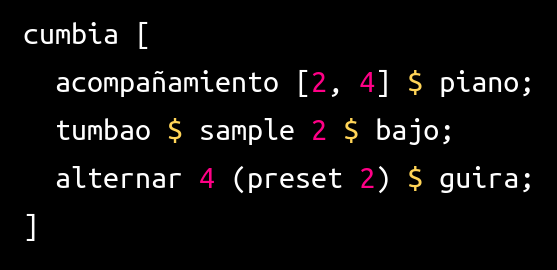
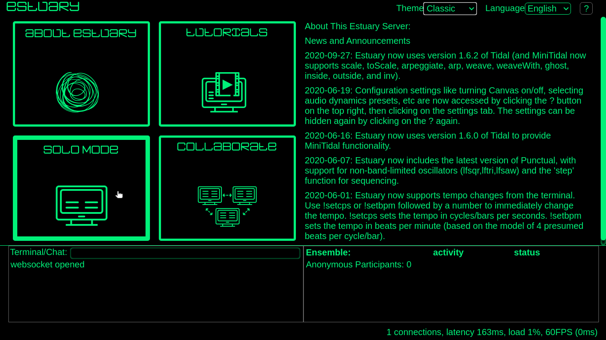
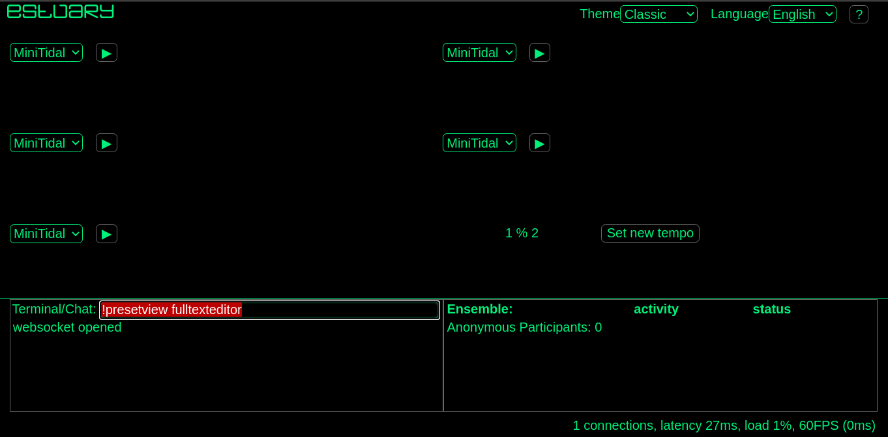
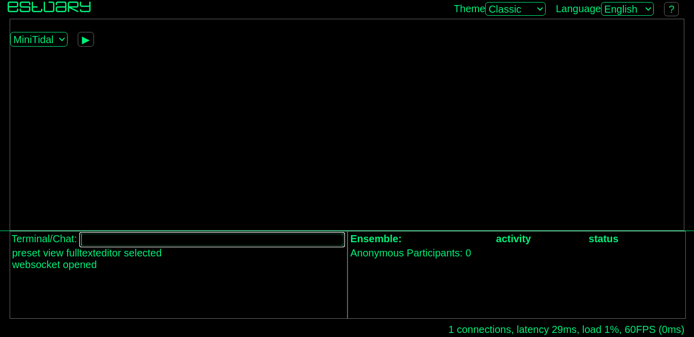
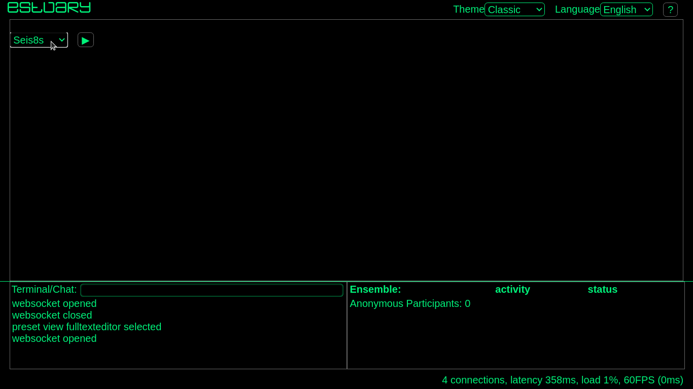
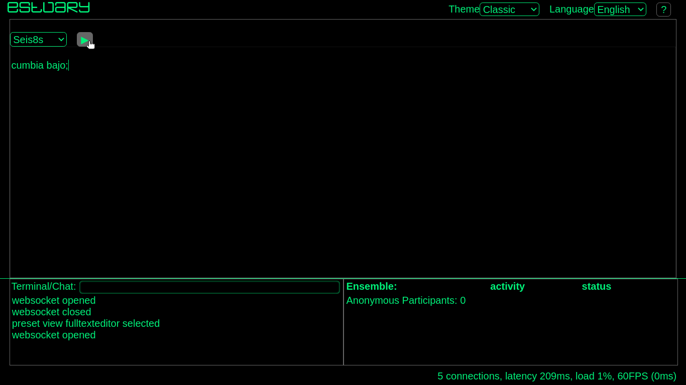

# seis8s

seis8s (pronunciado "seis octavos") es un lenguaje de programación que permite la interacción en tiempo real con audio digital y conocimiento musical localizado, particularmente de músicas de Latinoamérica.

seis8s es un proyecto reciente que pretende ser colaborativo, el cual pretene nutrirse con conocimiento musical consensuado y desde las diferentes fronteras personales y colectivas que existen en Latinoamérica.

---

## Índice

- [Editor_de_texto](#editor_de_texto)
- [Estilos_musicales](#estilos_musicales)
- [Referencia_rápida](#referencia_rápida)
- [Colaboradorxs](#colaboradorxs)
- [Pregutas_frecuentes](#preguntas_frecuentes)
- [Ayuda](#ayuda)
- [Licencia](#licencia)

---
## Editor_de_texto

sies8s se puede jugar de manera [individual](#individual), así como de manera [colectiva](#colectiva) a través de la plataforma Estuary (para ver más info sobre estuary haz click aqui: https://github.com/dktr0/estuary).

### individual
1_ Accesa a https://estuary.mcmaster.ca y da click en "solo mode".

2_ Una vez en "solo mode" veras muchas cajas de texto donde puedes escibir código. Para escribir más cómodamente en una sola caja de texto escribe el siguiente código en la parte de abajo donde dice "Terminal/Chat" y da enter en tu teclado:
<code> !presetview fulltexteditor. </code>

De esta forma ahora debes ver en la pantalla una sola caja de texto de tamaño grande.

3_Selecciona en el menu el lenguaje seis8s.

4_ Prueba seis8s escribiendo el siguiente código

<code> cumbia bajo; </code>

y hazlo sonar presionando el boton ▶ o presionando las teclas shift + enter. Una vez que lo ejecutes debes escuchar el sonido de un bajo con el ritmo base de la cumbia.

5_ Continua a la sección [estilos_musicales](#estilos_musicales) o a  [referencia_rápida](#referencia_rápida) para continuar jugando con seis8s.

## Referencia_rápida

- [Instrumentos](#instrumentos)
- [Sintaxis_básica](#sintáxis_básica)
- [Funciones_del_bajo](#funciones_del_bajo)
- [Funciones_del_teclado](#funciones_del_teclado)
- [Funciones_de_las_congas](#funciones_de__las_congas)
- [Funciones_de_la_guira](#funciones_de_la_guira)
- [Funciones_del_jamblock](#funciones_del_jamblock)

Esta es la referencia rápida del estilo de cumbia en seis8s.

### Instrumentos

<code> teclado; congas; jamblock; guira; bajo; </code>

Para silenciar los sonidos puedes utilizar el comando

<code> silencio </code>

### Sintaxis_básica

La función de estilo se coloca a la izquierda del instrumento.

<code> cumbia teclado; </code>

Todas las funciones que modifican el estilo se agregan a la izquierda del instrumento seguidas de un paréntesis o un signo de peso "$".

<code> acompañamiento 2 (cumbia teclado); </code>

El signo $ es equivalente a los paréntesis.

<code> acompañamiento 2 $ cumbia teclado; </code>

Para silenciar los sonidos puedes utilizar el comando

<code> silencio </code>

### Funciones_del_bajo
<b> sample </b> permite cambiar la muestra de audio o sample. Acepta números enteros iguales o mayores que 0.

<code> sample 0 $ cumbia bajo;  </code>

<b style="background:orange;"> tumbao </b> permite accessar a los distintos pre-sets del bajo. Acepta números enteros iguales o mayores que 0.

<code> tumbao 1 $ cumbia bajo;  </code>

Con la función <code style="background:orange;">  tumbao </code> también puedes sobreescribir los tumbaos default.

<code> tumbao ("1a" "3a" "5a") $ cumbia bajo; </code>

### Funciones_del_teclado

### Funciones_de_las_congas

## Estilos_musicales

<a href="https://github.com/luisnavarrodelangel/seis8s/blob/master/Referencia.md"> ¿Cómo usar seis8s? </a>
