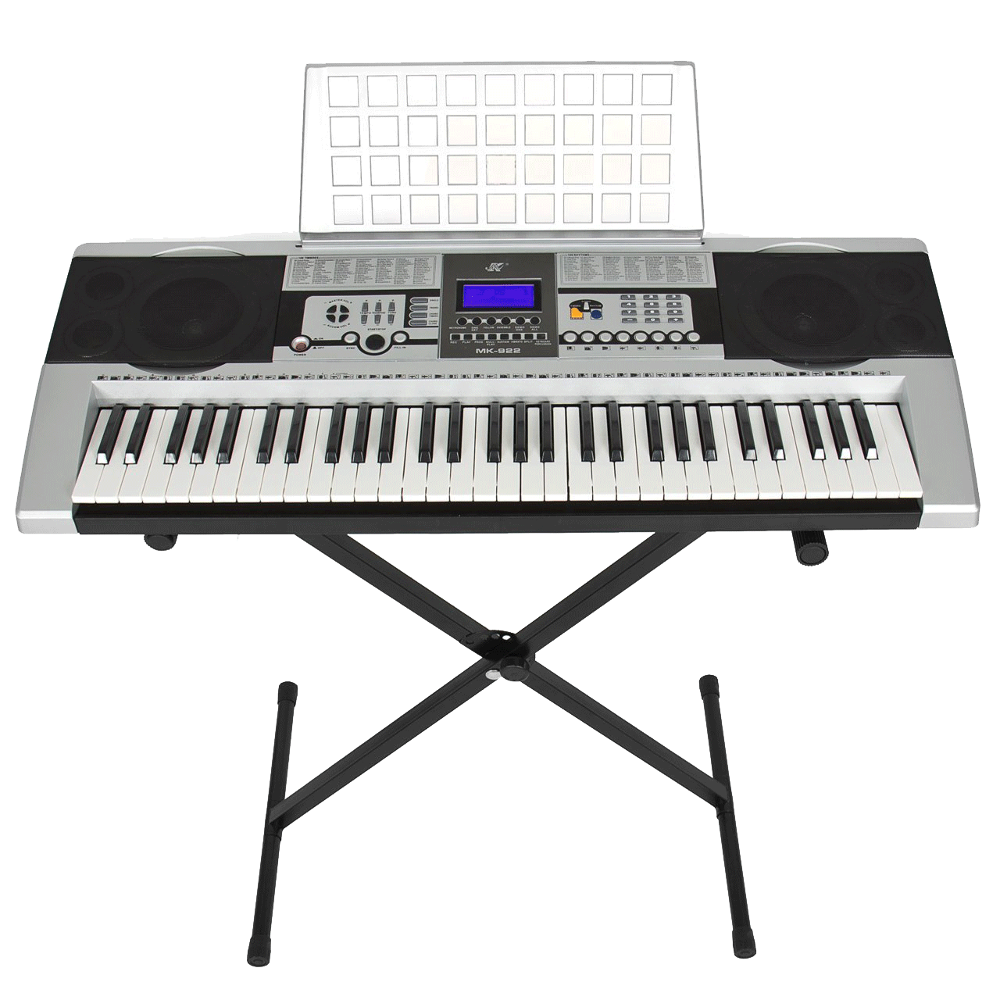

# seis8s

seis8s (pronunciado "seis octavos") es un lenguaje de programación que permite la interacción en tiempo real con audio digital y conocimiento musical localizado, particularmente de músicas de Latinoamérica. Seis8s es un proyecto reciente que pretende ser colaborativo, a través de conocimiento musical consensuado desde las diferentes fronteras personales y colectivas que existen en conexión con América Latina.

Seis8s también espera ser una crítica ideológica del sistema mundial de música por computadora dominante en lugar de una abstracción acrítica de las distintas visiones del mundo.

El primer "módulo" de seis8s produce música influenciada por la cumbia sonidera, un estilo particular de la clase trabajadora mexicana en México y Estados Unidos. Para obtener más información sobre Cumbia sonidera, consulte el libro <a href="http://beyond-digital.org/sonideros/EPS%20Libro-%20Sonideros%20en%20las%20aceras,%20vengase%20la%20gozadera%20-%20PDFvert.pdf" target="_blank">Sonideros en las aceras, véngase a gozadera</a>. Para comenzar a usar seis8s continue al [índice](#índice) que esta abajo.

---

## Índice

- [Editor_de_texto](#editor_de_texto)
- [Referencia_rápida](#referencia_rápida)
- [Videos](#videos)
- [Estilos_musicales](#estilos_musicales)
- [Colaboradorxs](#colaboradorxs)
- [Licencia](https://github.com/luisnavarrodelangel/seis8s/blob/master/LICENSE)
<!-- - [Pregutas_frecuentes](#preguntas_frecuentes)
- [Ayuda](#ayuda) -->
---
## Editor_de_texto

sies8s se puede jugar de [forma_individual](#forma_individual), así como de manera [colectiva](#colectiva) a través de la plataforma Estuary (para ver más info sobre estuary haz click aqui: https://github.com/dktr0/estuary).

#### Forma_Individual
1_ Accesa a https://estuary.mcmaster.ca y da click en "solo mode".

2_ Una vez en "solo mode" veras muchas cajas de texto donde puedes escibir código. Para escribir más cómodamente en una sola caja de texto escribe el siguiente código en la parte de abajo donde dice "Terminal/Chat" y da enter en tu teclado:
<code> !presetview fulltexteditor. </code>

De esta forma ahora debes ver en la pantalla una sola caja de texto de tamaño grande.

3_Selecciona en el menu el lenguaje seis8s.

4_ Prueba seis8s escribiendo el siguiente código

<code> cumbia bajo; </code>

y hazlo sonar presionando el boton ▶ o presionando las teclas shift + enter. Una vez que lo ejecutes debes escuchar el sonido de un bajo con el ritmo base de la cumbia.

5_ Continua a la sección  [referencia_rápida](#referencia_rápida) o a [estilos_musicales](#estilos_musicales) para continuar jugando con seis8s.

---

## Referencia_rápida

Esta es la referencia rápida del estilo de cumbia en seis8s.

- [Instrumentos](#instrumentos)
- [Sintaxis_básica](#sintáxis_básica)
- [Funciones_del_bajo](#funciones_del_bajo)
- [Funciones_del_teclado](#funciones_del_teclado)
- [Funciones_de_las_congas](#funciones_de_las_congas)
- [Funciones_de_la_guira](#funciones_de_la_guira)
- [Funciones_del_jamblock](#funciones_del_jamblock)

---

#### Instrumentos

<code> teclado; congas; jamblock; guira; bajo; </code>

Para silenciar los sonidos puedes utilizar el comando

<code> silencio </code>

---
#### Sintaxis_básica

La función de estilo se coloca a la izquierda del instrumento:

<code> cumbia teclado; </code>

Todas las funciones que modifican el estilo se agregan a la izquierda del instrumento seguidas de un paréntesis o un signo de peso "$":

<code> acompañamiento 2 (cumbia teclado); </code>

El signo $ es equivalente a los paréntesis:

<code> acompañamiento 2 $ cumbia teclado; </code>

Para silenciar los sonidos puedes utilizar el comando:
<code> silencio </code>

---
#### Funciones_del_bajo

**sample** permite cambiar la muestra de audio o sample. Acepta números enteros iguales o mayores que 0. Hay 4 pre-sets disponibles.

<code> sample 0 $ cumbia bajo;  </code>

**tumbao** permite accessar a los distintos pre-sets del bajo. Acepta números enteros iguales o mayores que 0.

<code> tumbao 1 $ cumbia bajo;  </code>

Con la función <code> tumbao </code> también puedes sobreescribir las notas de los tumbaos.

<code> tumbao ("1a" "3a" "5a") $ cumbia bajo; </code>

También puedes reesecribir los ritmos de los tumbaos.

<code> tumbao ("1a" 5a") (1 3) $ cumbia bajo; </code>

También se pueden hacer listas de notas y ritmos de la siguiente forma.

<code> tumbao ["1a" "5a", "1a" "3a" "5a"] [1 3, 1 3 4] $ cumbia bajo; </code>

---
#### Funciones_del_teclado

**sample** permite cambiar la muestra de audio o sample. Acepta números enteros iguales o mayores que 0.

<code> sample 1 $ cumbia teclado;  </code>

**tumbao** permite accessar a los distintos pre-sets del teclado como lo hicimos con el bajo arriba. Acepta números enteros iguales o mayores que 0.

<code> tumbao 2 $ cumbia teclado;  </code>

**acompanamiento** o **acompañamiento** modifica el ritmo en el que se tocan los acordes o bloques de notas del teclado.

<code> acompanamiento 2 $ cumbia teclado; </code>  
<code> acompanamiento (2 4) $ cumbia teclado; </code>

También sirve para modificar las notas del teclado. Acepta hasta un máximo de 4 notas.

<code> acompanamiento 2 ("1a" "3a" "5a") $ cumbia teclado; </code>  
<code> acompanamiento (2 4) ("1a" "3a" "5a") </code>

También se puede modificar la octava de la nota, es decir que tan grave o agudo suena.

<code> acompanamiento 2 ("1a" "3a" ("5a" 1)) $ cumbia teclado; </code>  
<code> acompanamiento 2 ("1a" "3a" ("5a" (-1)) $ cumbia teclado; </code>

---
#### Funciones_de_las_congas

**tumbao** permite accessar a los distintos pre-sets de las congas como lo hicimos con teclado y el bajo arriba. Acepta números enteros iguales o mayores que 0. Hay 4 disponibles.

<code> tumbao 4 $ cumbia congas;  </code>

**marcha** permite asignar los golpes de la palma, tapado y abierto a las congas. Por default suena el tambor quinto de la conga.

<code> marcha ("p" "t" "p" "a") $ cumbia congas </code>

También permite escribir el rimto de las congas.

<code> marcha ("p" "t" "p" "a" "a") (1 2 3 4 4.5) $ cumbia congas </code>

También permite accesar a otros tambores de las congas como la  tumbadora.

<code> marcha ("p" "t" "p" (t "a") (t "a")) (1 2 3 4 4.5) $ cumbia congas </code>

También se pueden hacer listas de notas y ritmos de la siguiente forma.

<code> marcha ["p" "t" "p" "a", "p" "t" "p" (t "a") (t "a")] [1 2 3 4, 1 2 3 4 4.5] $ cumbia congas; </code>

---
#### Funciones_de_la_guira

**preset** permite accesar a algunos ritmos pre-cargados de la guira. Hay 2 disponibles.

cumbia guira;

---
#### Funciones_del_jamblock

cumbia jamblock;

---

## Videos

Da click en cualquiera de los siguientes videos.

## Estilos_musicales

Para conocer más sobre los estilos musicales disponibles en seis8s vea <a href="https://github.com/luisnavarrodelangel/seis8s/blob/master/Estilos.md"> Estilos musicales </a>.

## Colaboradorxs

Esta sección esta en construcción.
